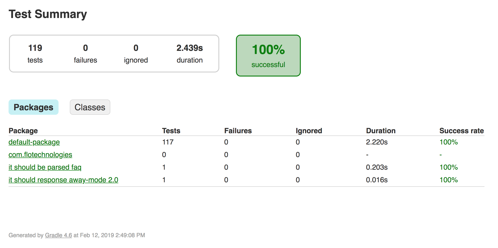

# flo-android-sdk

<!-- []() -->
[](https://codecov.io/gh/FloTechnologies/flo-android-sdk)



## Usage

```kotlin
val flo = Retrofit.Builder()
            .client(OkHttpClient.Builder().build())
            .addCallAdapterFactory(RxJava2CallAdapterFactory.create())
            .addConverterFactory(LoganSquareConverterFactory.create())
            .baseUrl("https://api.flotechnologies.com/v1") // change it
            .build().create(Flo::class.java)

val auth = HashMap<String, String>()
auth.put("username", "") // change it
auth.put("password", "") // change it

flo.auth(auth).subscribe { token ->
  println(token)
}
```

## Installation

```gradle
repositories {
    jcenter()

}

dependencies {
    compile 'com.flotechnologies:flo-sdk:0.0.4'
    compile 'com.flotechnologies:flo-android-sdk:0.0.4' // for android
}
```

## TODO

* Separate a module from flo-sdk for models, so we can refer models in other modules such as flo-sdk (restful API) and flo-sdk-websocket

## Development

```sh
./gradlew assemble
```

## Deployment

```sh
./gradlew assemble bintrayUpload
```

## LICENSE
