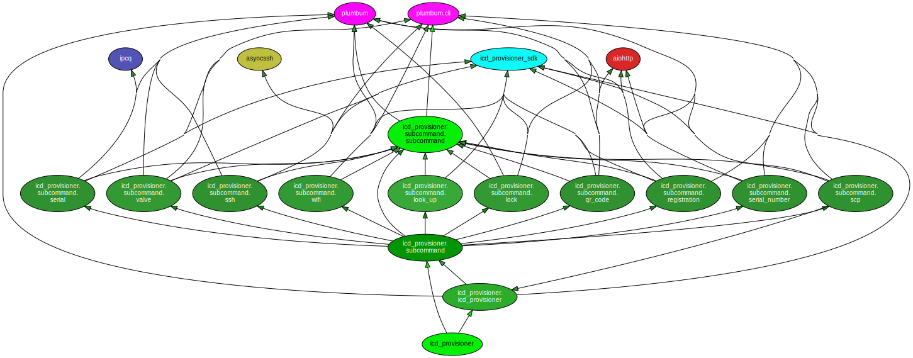
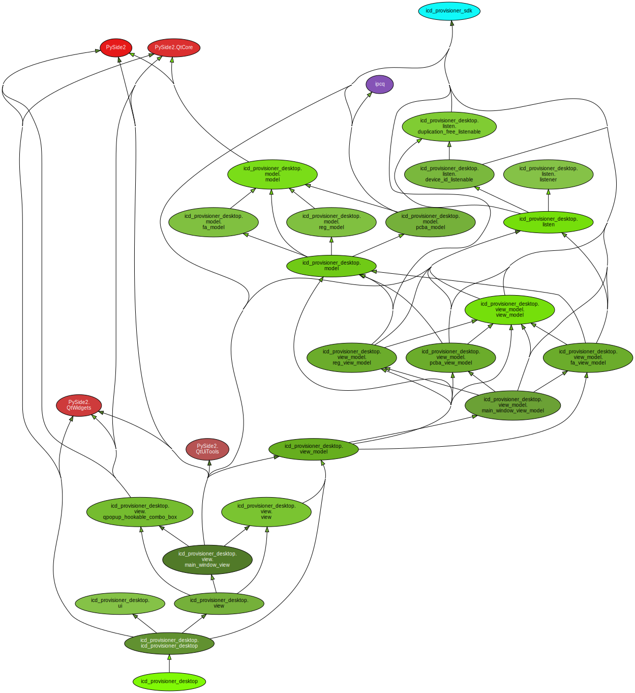
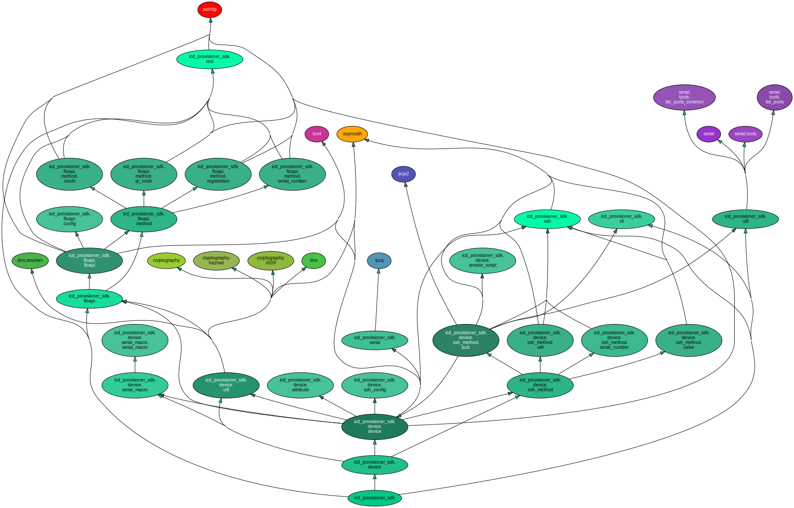

# icd-provisioner

## Installation

### Windows

Download the latest installer from the [Google Drive](https://drive.google.com/drive/folders/1AWD80Elkc5UNy1zrJ2NPx43jQQ5zbkAF).

### macOS and Linux Distributions

1. Install [pyenv](https://github.com/pyenv/pyenv).
2. Install Python 3.9 or above with [pyenv](https://github.com/pyenv/pyenv).
    ```sh
    pyenv install 3.9:latest
    ```
3. Install [pipx](https://github.com/pipxproject/pipx).
4. Install icd-provisioner with [pipx](https://github.com/pipxproject/pipx).
    ```sh
    pipx install --python "$(pyenv shims | grep python3.9$ | head -n 1)" git+ssh://git@gitlab.com/flotechnologies/firmware/unicorn-mfg/icd-provisioner.git
    ```

## Usage

### Windows

<Start Menu> → icd-provisioner

or

`icd-provisioner`/`icd-provisioner-desktop` in CMD.

### macOS

#### Without Docker

1. Install `icd-provisioner` by following the instructions below.
2. Run the CLI version of `icd-provisioner` or the desktop version:

   ```
   icd-provisioner
   # or
   icd-provisioner-desktop
   ```

#### With Docker

1. Install [Docker](https://www.docker.com/) and [Docker Compose](https://docs.docker.com/compose/).

2. `git-clone` and `cd` into this repo.

3. Run the CLI version of `icd-provisioner`:

   ```
   docker-compose run --rm icd-provisioner
   ```

## Development

### Environment Setup

#### Prerequisites

1. [Git](https://git-scm.com/downloads)
2. [Python 3.9](https://www.python.org/downloads/) (Make sure adding the Python executable to `PATH`)
3. [poetry](https://python-poetry.org/docs/#installation)

#### Setup Steps

1. 
   ```
   git clone git@gitlab.com:flotechnologies/firmware/unicorn-mfg/icd-provisioner.git
   ```
2. `cd` into the git cloned project folder.
3. 
   ```
   poetry install
   ```

### Packing

#### Windows

##### Prerequisites

1. [Nullsoft Scriptable Install System](https://nsis.sourceforge.io/Download)

##### Instructions

1. Open `Command Prompt`.
2. `cd` into the git cloned project folder.
3. 
    1. Pack for a regular version
        ```
        bin\pack.py
        ```
    2. Pack for Vtech
        ```
        bin\pack.py --config data\configs\vtech.toml
        ```
4. The result will be at `<Project Root>\build\nsis\icd-provisioner-<version number>-<varient>.exe`

### Dependency Graph

The project retains clean dependencies. Please refer to the following graphs

#### icd_provisioner



#### icd_provisioner_desktop



#### icd_provisioner_sdk


